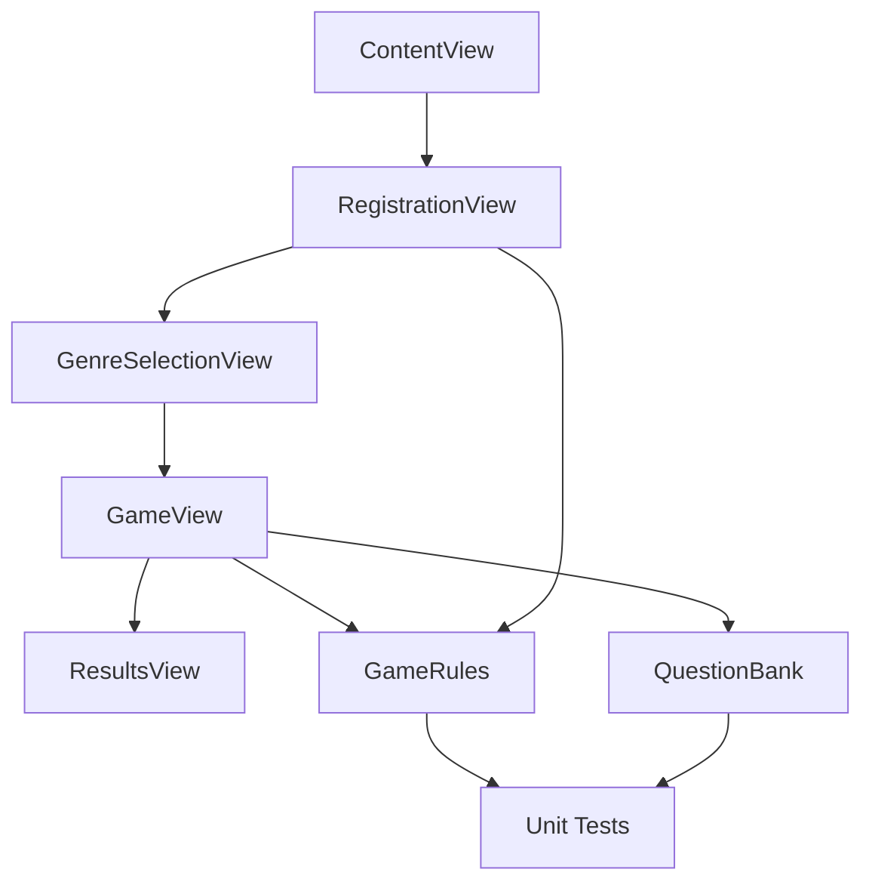

# MillionaireGame

[](https://github.com/Amartya2001-droid/MillionaireGame/actions/workflows/ios-build.yml)

MillionaireGame is a SwiftUI iOS quiz app inspired by the pacing of "Who Wants to Be a Millionaire?". It combines a polished game flow with clean architecture, CI-backed verification, and small testable logic components that make the project feel production-minded rather than thrown together.

## Highlights

- Built with SwiftUI for iOS
- Clean navigation from landing page to registration, genre selection, gameplay, and results
- Time-based progression with a 15-question prize ladder
- 50:50 hint mechanic and local best-score persistence
- Extracted game rules for testable business logic
- GitHub Actions workflow that builds and tests the app on macOS

## Tech Stack

- Swift
- SwiftUI
- XCTest
- Xcode
- GitHub Actions

## Architecture



## Project Structure

- `MillionaireGame/ContentView.swift`
  Entry point for the landing screen and app navigation.
- `MillionaireGame/GameFlowViews.swift`
  Registration, genre selection, gameplay, results, and instructions.
- `MillionaireGame/GameRules.swift`
  Pure game-logic helpers for validation, timing, and hint reduction.
- `MillionaireGame/Models.swift`
  Core domain models such as `PlayerProfile`, `GameQuestion`, and `GameOutcome`.
- `MillionaireGame/QuestionBank.swift`
  Quiz data and prize ladder configuration.
- `MillionaireGame/DesignSystem.swift`
  Shared visual styling, button styles, and UI helpers.
- `MillionaireGameTests/MillionaireGameTests.swift`
  Unit tests for core game logic.
- `.github/workflows/ios-build.yml`
  GitHub Actions workflow for simulator builds and tests.

## Gameplay

1. Start from the home screen.
2. Enter player details.
3. Choose a quiz genre.
4. Answer 15 questions against the clock.
5. Use up to three 50:50 hints strategically.
6. Finish the ladder and aim for the top prize.

## What I Focused On

- Breaking a prototype-style codebase into focused files
- Keeping UI code readable while moving rules into testable logic
- Making the repository presentable and verifiable on GitHub
- Using CI so the project shows build discipline even without local Xcode installed

## Running Locally

### Requirements

- macOS
- Full Xcode installation
- iOS Simulator or physical Apple device

### Setup

```bash
git clone https://github.com/Amartya2001-droid/MillionaireGame.git
cd MillionaireGame
open MillionaireGame.xcodeproj
```

Choose a simulator in Xcode and run with `Cmd + R`.

## Automated Verification

The repository includes a GitHub Actions workflow that:

- Selects Xcode on a macOS runner
- Builds the app for iOS Simulator
- Runs the unit test suite

That means visitors can immediately see whether the current `main` branch is healthy.

## Future Improvements

- Add richer game audio and motion feedback
- Expand the question bank and difficulty scaling
- Add accessibility improvements and voice guidance
- Add screenshot assets or a demo video for the README

## License

No license has been added yet.
